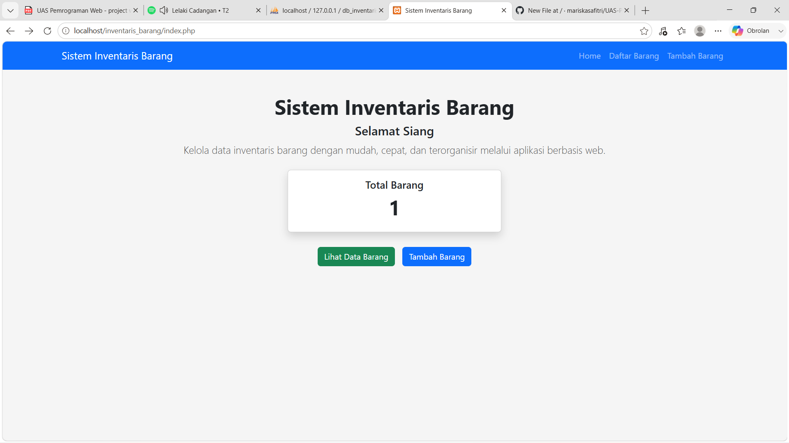
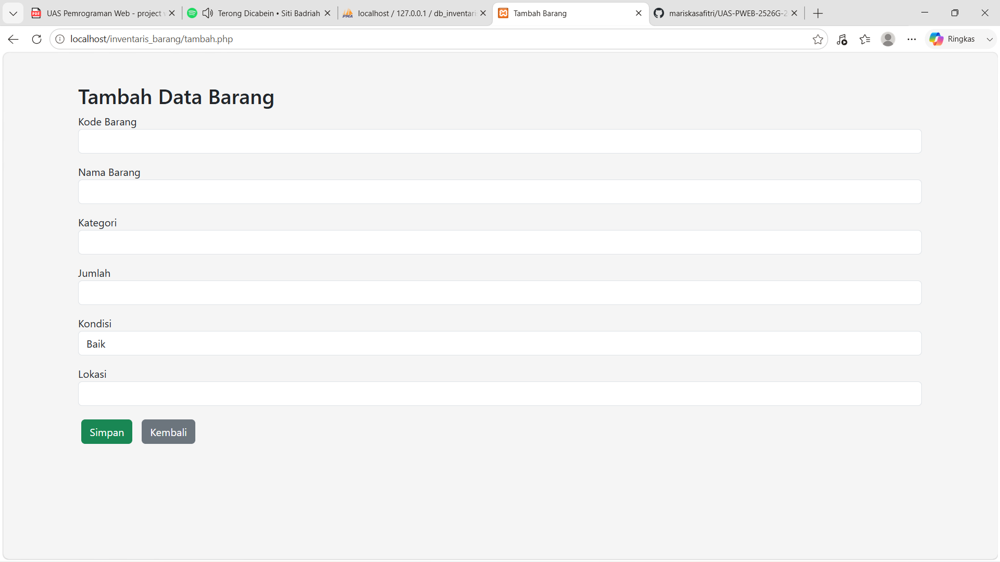
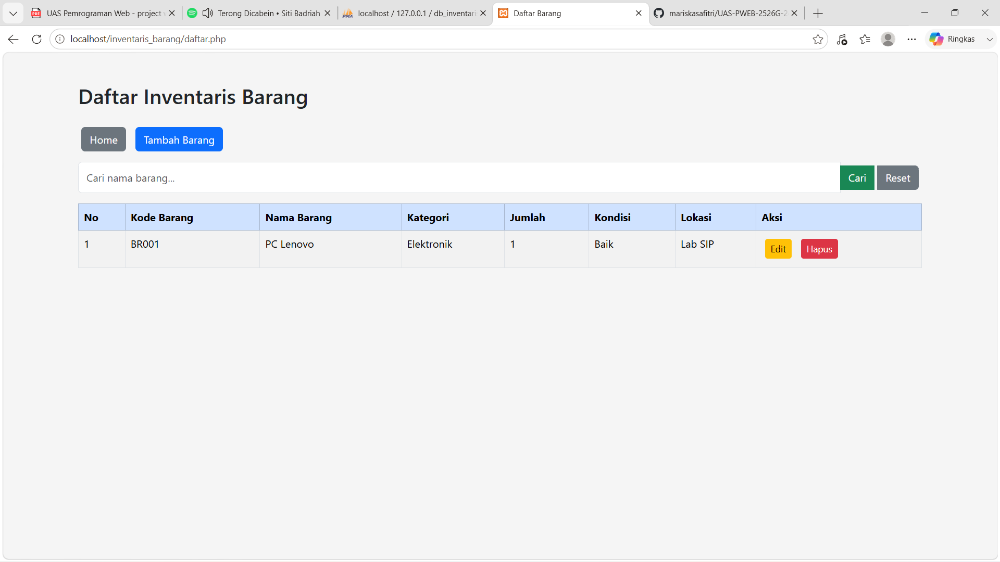

# Sistem Inventaris Barang

## Nama
Mariska Safitri

## NIM
240631100052

## Deskripsi
Aplikasi Sistem Inventaris Barang berbasis web menggunakan PHP Native dan MySQL untuk mengelola data barang.

## Screenshot Aplikasi

### Halaman Home

### Halaman Tambah Barang

### Halaman Daftar Barang

## Database
Nama Database: db_inventaris

Tabel:
- barang

## Cara Menjalankan
1. Jalankan Apache dan MySQL.
2. Import file `db_inventaris.sql`.
3. Simpan project ke folder `htdocs`.
4. Buka browser.
5. Akses `http://localhost/UAS-PWEB-2526G-240631100052/`

## Teknologi
- HTML
- CSS
- Bootstrap
- PHP Native
- MySQL
